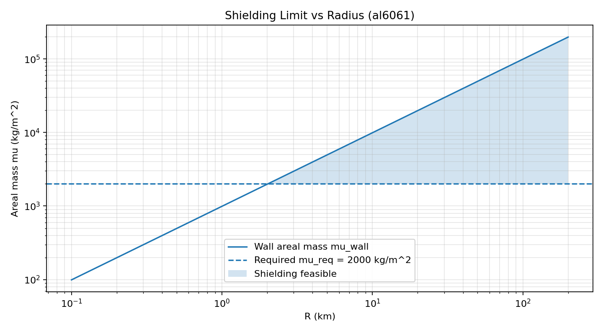
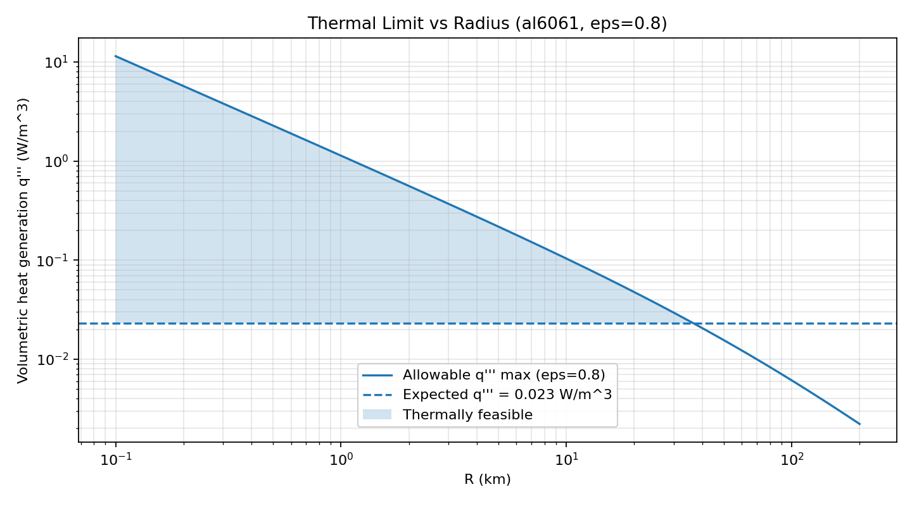
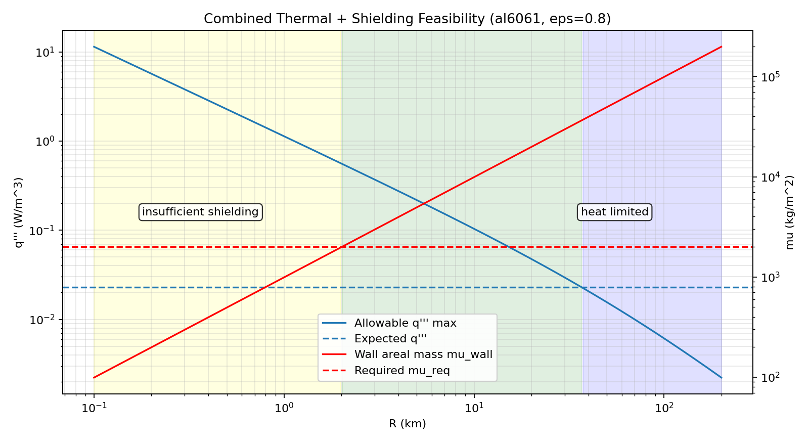

# Habitat Sphere Output Report

[Back to parent README](../README.md)

Generated by `python -m hab_sphere.cli`.

## Run Parameters

- material: `al6061`
- p (Pa): `101325.0`
- sigma_allow (Pa): `138000000.0`
- rho (kg/m^3): `2700.0`
- k (W/m/K): `170.0`
- T_space (K): `3.0`
- T_in_max (K): `303.0`
- h_i (W/m^2/K): `inf`
- temp_constraint_target: `inner_surface`
- q_expected (W/m^3): `0.023`
- mu_req (kg/m^2): `2000.0`
- radius range (km): `0.1` to `200.0`
- N: `400`
- R_scale: `log`

## Shielding Plot

## Epsilon 0.8

- first thermal-pass radius (km): `0.1`
- first shielding-pass radius (km): `2.0285`
- first both-pass radius (km): `2.0285`
- csv: `results_al6061_eps0p8.csv`

