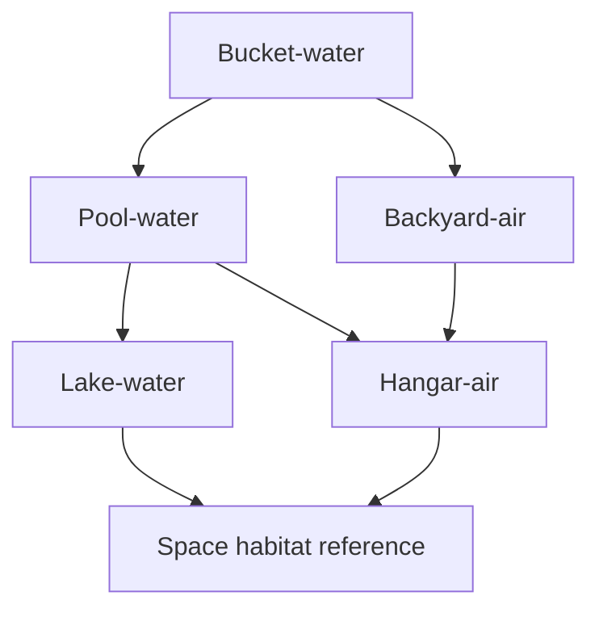

# Friction Buffers Experiment Roadmap — AI Image Prompt Specs

This document is a **prompt-and-spec sheet** for generating a consistent set of AI images that communicate the **scale**, **geometry**, and **purpose** of the friction-buffers concept and its experimental roadmap.

Use this file as the single source of truth for Codex-driven image generation.

---

## Concept summary (include in every prompt, condensed)

A “friction buffers” habitat (and its scaled experiments) uses **one rotating inner cylinder** surrounded by **many co-rotating shrouds / sleeves** (nested cylinders). These sleeves act as **flow dividers** so that the total rim-speed difference is split across many small annular gaps, reducing windage and stabilizing shear.

Key features to depict:

- **Nested sleeves**: multiple concentric cylindrical shells surrounding the main rotating tube.
- **Flow-dividers**: sleeves reduce relative velocity between adjacent air layers.
- **Annular gaps**: each sleeve-to-sleeve gap is a narrow ring-shaped channel (air or water depending on experiment).
- **End treatment**: the sleeves are open-ended or nearly open-ended; there is a **small circumferential clearance at the ends** (a “ring opening”) so that sleeves do not scrape end-walls, and to show the **end-leakage challenge**.
- **Conical end caps (optional, conceptual)**: a gentle conical “cup” end-piece that rotates with the sleeves to reduce end recirculation; show ribs/vanes hinting at swirl-braking.
- **Drive system**: each experiment includes a motor + gearbox (or belt drive), clearly shown with mounting.
- **Human scale**: include at least one adult human (standing, crouching, or on a platform) for scale.

**Important:** These are *illustrative engineering visuals*, not exact CAD.

---

## Global style rules (consistency across the whole set)

- **Render style**: clean technical illustration / concept art (semi-realistic), **high clarity**, not cartoonish.
- **View**: 3/4 isometric cutaway, with a **partial transparent outer shell** so the nested sleeves are visible.
- **Lighting**: neutral studio lighting; readable shadows; avoid dramatic cinematic fog.
- **Materials**:
  - Experiments (bucket/pool/lake): plastics + aluminum + steel shafts; water is slightly tinted for visibility.
  - Air experiments: clear structural frames, acrylic/transparent panels where helpful.
  - Habitat: large inflatable/beam structure vibe, smooth metallic rotating tube, translucent pressure envelope.
- **Color coding** (subtle): rotating parts slightly warmer tint; stationary frame slightly cooler tint.
- **Annotations**: *no text labels burned into the image* (we will add labels later in diagrams). If the model insists, allow tiny unobtrusive callouts but avoid.
- **No clutter**: minimal background objects; focus on the rig + environment cues.
- **Safety realism**: show cages/guards around exposed rotating shafts on anything larger than bucket scale.

---

## Shared geometric language

Use these terms consistently in prompts:

- **Inner rotor**: the main rotating cylinder (the “habitat tube” analog).
- **Sleeves / shrouds / flow dividers**: concentric co-rotating shells around the rotor.
- **Outer container**: stationary boundary (bucket wall, pool wall, lake boundary ring, hangar structure).
- **Gap**: radial spacing between adjacent cylinders.
- **End clearance ring**: small annular opening at ends (depict as a visible circumferential gap).

---

## Speculated stage counts (purely for visualization)

Stage count here is **not a final engineering decision**; it is to help visuals communicate the multi-stage idea.

- Bucket scale: **5 sleeves** (≈ 6 annular regions including rotor-to-sleeve, sleeve-to-sleeve…)
- Pool/backyard scale: **9 sleeves**
- Lake/hangar scale: **17 sleeves**
- Space habitat reference: **17 sleeves** (matches long-term conceptual target)

---

## Dimension and environment table (reference)

These are the working numbers used in the roadmap images.

| Node | Inner radius ri | Outer radius ro | Gap g (ro-ri for single annulus) | Active length L | Environment |
|---|---:|---:|---:|---:|---|
| Bucket-water | 0.084 m | 0.140 m | 0.056 m | 0.30 m | garage/workbench |
| Pool-water (10 ft “deep”) | 1.224 m | 1.524 m | 0.30 m | 1.10 m | backyard |
| Backyard-air | 1.224 m | 1.524 m | 0.30 m | 1.10 m | backyard (frame structure) |
| Lake-water | 8 m | 10 m | 2 m | 15 m | lake (institutional test) |
| Hangar-air | 8 m | 10 m | 2 m | 15 m | aircraft hangar / industrial hall |
| Space habitat reference | 250 m | 252 m | 2 m | (very long tube) | space (inside pressure envelope) |

---

## Prompt template (copy/paste)

Use this template for every image and fill in the bracketed fields.

**Prompt:**

> Create a high-clarity technical concept illustration of a friction-buffers rotating-cylinder experiment.  
> Show a 3/4 isometric cutaway with partial transparency so concentric nested sleeves are visible.  
> Depict an inner rotating cylinder (radius [ri]) surrounded by [N] co-rotating concentric sleeves (flow dividers) inside a stationary outer boundary (radius [ro]).  
> Show narrow annular gaps and a visible small circumferential end clearance ring at both ends.  
> Include a gentle conical end-cap concept with subtle swirl-brake ribs (conceptual), and show that end leakage is a key challenge via visible open-end clearances.  
> Include a motor + gearbox drive system ([motor placement: above/below/side]) with guards and supports, connected via shaft or belt drive.  
> Add at least one adult human for scale.  
> Environment: [environment cue].  
> Materials: plastic, aluminum, steel; water or air as appropriate.  
> Style: clean engineering concept art, realistic proportions, neutral lighting, no text labels.

**Negative prompt (if supported):**

> No exploded view, no text labels, no unrealistic sci-fi glow, no fantasy ornaments, no messy clutter, no tiny unreadable components, no fish-eye distortion.

---

## Per-image specs (ready-to-run prompt blocks)

### 1) Bucket-water (root experiment)

**Goal:** Make the smallest rig feel real and buildable. Emphasize the nested sleeves and end clearance rings.

- Fluid: water  
- ri = 0.084 m (6" PVC OD / 2)  
- ro = 0.140 m (bucket effective radius)  
- L = 0.30 m  
- Sleeves: 5  
- Motor power class: 100 W DC motor + gearbox  
- Motor placement: **below** (bench-mounted motor driving vertical shaft up into rotor), or side-mounted belt drive  
- Environment: **garage workbench** with simple tools; spill tray; safety shield

**Prompt block:**

> Create a high-clarity technical concept illustration of a small friction-buffers bucket experiment.  
> 3/4 isometric cutaway with partial transparency.  
> Inner rotating PVC-like cylinder radius 0.084 m inside a 5-gallon bucket outer radius 0.140 m, water-filled to 0.30 m height.  
> Surround the inner rotor with 5 thin co-rotating sleeves (flow dividers), concentric and evenly spaced.  
> Show narrow annular gaps and a visible small end clearance ring at top and bottom for each sleeve.  
> Include a compact 100 W DC motor with a gearbox below the bucket, driving a vertical shaft; include a simple guard and mounting plate.  
> Include one adult human standing next to the bench for scale.  
> Materials: PVC, acrylic sleeves, aluminum shaft, steel fasteners; water slightly tinted for visibility.  
> Clean engineering concept art, neutral lighting, no text labels.

---

### 2) Pool-water (10 ft “deep” backyard scale)

**Goal:** Communicate the jump in size and the idea that the pool wall is the stationary boundary. Emphasize that this is still a single Couette tube, but with many sleeves.

- Fluid: water  
- ri = 1.224 m  
- ro = 1.524 m (10 ft pool radius)  
- g = 0.30 m  
- L = 1.10 m (deeper-than-typical small pool)  
- Sleeves: 9  
- Motor power class: 1 kW with gearing  
- Motor placement: **platform above** pool edge driving down a central shaft OR side belt drive with frame tower  
- Environment: **backyard**, cheap above-ground pool, unsightly but functional; safety railings

**Prompt block:**

> Create a high-clarity technical concept illustration of a backyard friction-buffers pool experiment.  
> 3/4 isometric cutaway with partial transparency.  
> A 10-foot-diameter above-ground pool forms the stationary outer boundary (outer radius 1.524 m) filled with water to 1.10 m height.  
> Inside it, a large inner rotating cylinder radius 1.224 m is centered, surrounded by 9 co-rotating sleeves (flow dividers) in the 0.30 m annular region.  
> Show narrow annular gaps, concentric sleeves, and a visible small circumferential end clearance ring at both ends.  
> Include a 1 kW motor with gearbox on a sturdy platform above the pool edge, driving a vertical shaft down into the rotor; show safety guarding and a frame tower.  
> Include two adults for scale standing near the pool with railings.  
> Clean engineering concept art, neutral lighting, no text labels.

---

### 3) Backyard-air (neutral-buoyancy air rig, same footprint as pool)

**Goal:** Same geometry as pool, but in air with a frame, transparent panels, and visible “floating” neutral-buoyancy elements (e.g., helium bladders or foam floats) without overexplaining.

- Fluid: air  
- ri = 1.224 m  
- ro = 1.524 m  
- L = 1.10 m  
- Sleeves: 9  
- Motor power class: 1 kW with gearing  
- Motor placement: **side-mounted** or above, with guards  
- Environment: backyard; looks like a big ring-shaped test rig (open framework)

**Prompt block:**

> Create a high-clarity technical concept illustration of a backyard air-based friction-buffers experiment (neutral-buoyancy style).  
> 3/4 isometric cutaway with partial transparency.  
> Stationary outer boundary radius 1.524 m as a rigid circular frame (not water), enclosing an inner rotating cylinder radius 1.224 m with 9 co-rotating sleeves in the 0.30 m annulus.  
> Show annular gaps and visible small circumferential end clearance rings; show subtle conical end-caps with swirl-brake ribs conceptually.  
> Depict lightweight neutral-buoyancy supports (small helium bladders or foam floats) holding parts in alignment without heavy bearings, but keep it believable and minimal.  
> Include a 1 kW motor with gearbox mounted on the side frame, belt-driving the rotor; show guards.  
> Include one adult human for scale; backyard setting with minimal clutter.  
> Clean engineering concept art, neutral lighting, no text labels.

---

### 4) Lake-water (institutional scale)

**Goal:** Show that this is now a large engineering facility in a lake: anchored rings, floating platforms, safety boats, and measurement towers.

- Fluid: water (lake)  
- ri = 8 m  
- ro = 10 m  
- g = 2 m  
- L = 15 m  
- Sleeves: 17  
- Power class: ~15 kW continuous (SUV “highway-load” equivalent) delivered via long shaft + gearing  
- Motor placement: **floating platform** or shore-based winch/gearbox feeding a shaft  
- Environment: lake with deep water, support pontoons, instrument booms, safety boat; “institutional”

**Prompt block:**

> Create a high-clarity technical concept illustration of a large lake-based friction-buffers water experiment.  
> 3/4 isometric cutaway with partial transparency.  
> Show a giant annular test structure: stationary outer ring radius 10 m and inner rotating cylinder radius 8 m, extending 15 m vertically into the lake.  
> Surround the rotor with 17 co-rotating sleeves (flow dividers) in the 2 m annulus, with visible annular gaps and small end clearance rings at top and bottom.  
> Include conceptual conical end-caps with subtle swirl-brake ribs.  
> Drive system: an SUV-equivalent continuous power source (~15 kW) on a floating platform powering a gearbox that turns the rotor via a large shaft; show heavy guards and structural bracing.  
> Include multiple humans for scale on the platform and a small safety boat nearby.  
> Clean engineering concept art, neutral lighting, no text labels.

---

### 5) Hangar-air (same footprint as lake, indoor)

**Goal:** Same dimensions as lake, but indoors with cranes, scaffolding, and safety cages.

- Fluid: air  
- ri = 8 m  
- ro = 10 m  
- L = 15 m  
- Sleeves: 17  
- Power class: ~15 kW continuous (or facility motor)  
- Motor placement: **floor-mounted** motor + gearbox with guarded shaft drive  
- Environment: aircraft hangar / industrial hall; overhead crane; scaffolding

**Prompt block:**

> Create a high-clarity technical concept illustration of a hangar-scale air-based friction-buffers experiment.  
> 3/4 isometric cutaway with partial transparency.  
> Stationary outer boundary radius 10 m inside a hangar, inner rotating cylinder radius 8 m, 15 m tall, with 17 co-rotating sleeves in the 2 m annulus.  
> Show annular gaps, visible end clearance rings, and conceptual conical end-caps with swirl-brake ribs.  
> Include a floor-mounted industrial motor and gearbox (~15 kW continuous) driving the rotor via a guarded shaft; show cages, railings, and safety interlocks.  
> Include humans for scale and an overhead crane hook in the background.  
> Clean engineering concept art, neutral lighting, no text labels.

---

### 6) Space habitat reference (250 m radius, 1 g at rim)

**Goal:** Show the *real thing*: a huge rotating tube inside a pressurized macro-envelope with nested sleeves to reduce windage, walkable connections, and visible end-clearance challenges.

- Fluid: air (habitat atmosphere)  
- Rotor radius: 250 m  
- Target rim gravity: 1 g  
- Rim speed: ~49.5 m/s  
- Rotation rate: ~1.89 rpm  
- Gap used for Re comparison: 2 m (illustrative single annulus)  
- Sleeves: 17  
- Environment: space; translucent pressure envelope; docking/maintenance nodes; people inside

**Prompt block:**

> Create a high-clarity technical concept illustration of a friction-buffers space habitat.  
> 3/4 isometric cutaway with partial transparency.  
> Show a massive rotating habitat tube of radius 250 m inside a large translucent pressurized envelope filled with breathable air.  
> Depict 17 concentric co-rotating sleeves (flow dividers) around the rotating tube, forming many annular gaps that split rim-speed differences and reduce windage.  
> Show a small circumferential end clearance ring at sleeve ends and conceptual conical end-caps with swirl-brake ribs to hint at end-flow control challenges.  
> Include walkable internal connections and maintenance platforms in the microgravity volume outside the rotating tube, with a few small human figures for scale.  
> Show a rotation cue (subtle motion blur on the tube surface) consistent with 1 g at the rim (~1.89 rpm).  
> Clean engineering concept art, neutral lighting, no text labels.

---

## Dependency graph (for reference)

---

## Notes for Codex execution

- Generate **one image per prompt block** above.
- Keep camera angle and style consistent across the set.
- If the model struggles with “nested sleeves,” emphasize “many concentric cylindrical shells, like nested tubes” and “partial transparent cutaway.”
- If the model adds labels, rerun with stronger “no text” constraint.
