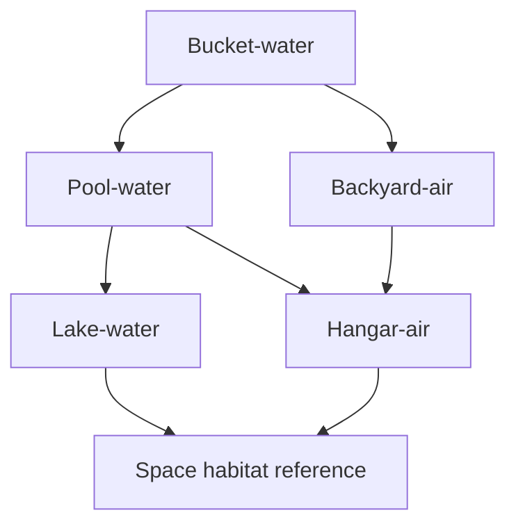

Create an image for this fliuid dynamics experiment.

This is an idea for a space habitat where **one rotating inner cylinder** is surrounded by **many co-rotating shrouds / sleeves** (nested cylinders). These sleeves act as **flow dividers** so that the total rim-speed difference is split across many small annular gaps, reducing drag.

Key features to depict:

- **Drive system**: each experiment includes a motor + gearbox (or belt drive), clearly shown with mounting.
- **Shaft**: As any motor has a shaft, this connects the motor to the inner rotor (at the cylinder's center), it is a generic metal rod.
- **Inner rotor**: the main rotating cylinder (the “habitat tube” analog).
- **Flow-dividers**: concentric cylindrical shells that divide the rotating flow.
- **Gap**: radial spacing between adjacent flow-dividers.
- **End treatment**: there is a cone-shaped taper towards the center with an opening that the shaft goes through. This taper exists on both the bottom and top of each flow divider. This makes the flow-dividers similar to Russian dolls, where each one nearly completely envelopes the one inside of it, with exception of holes to allow the shaft through.
- **Human scale**: include at least one adult human for scale.

The style is illustrative engineering visuals.

## Style rules

- **Render style**: clean technical illustration / concept art (semi-realistic), **high clarity**, not cartoonish, no text labels.
- **View**: 3/4 isometric cutaway, with a **partial transparent outer shell** so the nested sleeves are visible.
- **Lighting**: neutral studio lighting; readable shadows; avoid dramatic cinematic fog.
- **Materials**:
  - plastics + aluminum + steel shafts; water is slightly tinted for visibility.
- **Color coding** (subtle): rotating parts slightly warmer tint; stationary frame slightly cooler tint.
- **Annotations**: *no text labels burned into the image* (we will add labels later in diagrams). If the model insists, allow tiny unobtrusive callouts but avoid.
- **No clutter**: minimal background objects; focus on the rig + environment cues.
- **Safety realism**: show cages/guards around exposed rotating shafts on anything larger than bucket scale.

## Specific details for pool-water scenario

In this scenario a 10-foot-diameter above-ground pool forms the stationary outer boundary (outer radius 1.524 m) filled with water to 1.10 m height.
Inside it, a large inner rotating cylinder radius 1.224 m is centered, surrounded by 9 co-rotating sleeves (flow dividers) in the 0.30 m annular region.
The motor is a 1 kW motor with gearbox on a platform that spans accross the top of pool, driving a vertical shaft down into the rotor.
All of the inner rotor and flow-dividers, including the conical end taper, should be fully below the water level. The motor and platform should be above the water level.

Environment is a backyard, this is a cheap above-ground pool.

3/4 isometric cutaway with partial transparency where necessary to show detail.

## Specific details for backyard-air scenario

Create a high-clarity technical concept illustration of a backyard air-based friction-buffers experiment (neutral-buoyancy style).
This means that the inner rotor and surrounding flow-dividers are made of kite-like materials.
There are bubbles in a donut shape going around some flow dividers filled with Helium to keep them neurtral bouancy.
Show clear structure of the inner rotor and flow-dividers with transparency or cut-aways.

The donut filled with helium at the top of the flow dividers should be relatively small compared to the total.

- Fluid: air  
- ri = 1.224 m  
- ro = 1.524 m  
- L = 1.10 m  
- Sleeves: 9  
- Motor power class: 1 kW with gearing  
- Motor placement: on **ground** with shaft going up into the inner rotor  
- Environment: backyard; looks like a big ring-shaped test rig (open framework)

3/4 isometric cutaway with partial transparency.  
Show annular gaps and visible small circumferential end clearance rings; show subtle conical end-caps.  
Include one adult human for scale; backyard setting with minimal clutter.  
Clean engineering concept art, neutral lighting, no text labels.

Required clarification:

The motor shaft should go straight vertical up, from the motor. the inner rotor is basically a cylinder, but it needs to be a vertical cylinder. That is, a horizontal cross section would be a circle.

## Specific details for bucket-water scenario

- Fluid: water  
- ri = 0.084 m (6" PVC OD / 2)  
- ro = 0.140 m (bucket effective radius)  
- L = 0.30 m  
- flow-dividers: 5  
- Motor power class: 100 W DC motor + gearbox  
- Motor placement: **above** connected to tip of bucket by a plank
- Environment: **garage workbench**

In our case, L is the height of the inner rotor. The rotor is vertical.

The inner rotor and all flow-dividers are fully under the water level.
The motor is above the water and the shaft goes into the water.

---

### 4) Lake-water (institutional scale)

**Goal:** Show that this is now a large engineering facility in a lake: anchored rings, floating platforms, safety boats, and measurement towers.

- Fluid: water (lake)  
- ri = 8 m  
- ro = 10 m  
- g = 2 m  
- L = 15 m  
- Sleeves: 17  
- Power class: ~15 kW continuous (SUV “highway-load” equivalent) delivered via long shaft + gearing  
- Motor placement: **floating platform** or shore-based winch/gearbox feeding a shaft  
- Environment: lake with deep water, support pontoons, instrument booms, safety boat; “institutional”

**Prompt block:**

> Create a high-clarity technical concept illustration of a large lake-based friction-buffers water experiment.  
> 3/4 isometric cutaway with partial transparency.  
> Show a giant annular test structure: stationary outer ring radius 10 m and inner rotating cylinder radius 8 m, extending 15 m vertically into the lake.  
> Surround the rotor with 17 co-rotating sleeves (flow dividers) in the 2 m annulus, with visible annular gaps and small end clearance rings at top and bottom.  
> Include conceptual conical end-caps with subtle swirl-brake ribs.  
> Drive system: an SUV-equivalent continuous power source (~15 kW) on a floating platform powering a gearbox that turns the rotor via a large shaft; show heavy guards and structural bracing.  
> Include multiple humans for scale on the platform and a small safety boat nearby.  
> Clean engineering concept art, neutral lighting, no text labels.

---

### 5) Hangar-air (same footprint as lake, indoor)

**Goal:** Same dimensions as lake, but indoors with cranes, scaffolding, and safety cages.

- Fluid: air  
- ri = 8 m  
- ro = 10 m  
- L = 15 m  
- Sleeves: 17  
- Power class: ~15 kW continuous (or facility motor)  
- Motor placement: **floor-mounted** motor + gearbox with guarded shaft drive  
- Environment: aircraft hangar / industrial hall; overhead crane; scaffolding

**Prompt block:**

> Create a high-clarity technical concept illustration of a hangar-scale air-based friction-buffers experiment.  
> 3/4 isometric cutaway with partial transparency.  
> Stationary outer boundary radius 10 m inside a hangar, inner rotating cylinder radius 8 m, 15 m tall, with 17 co-rotating sleeves in the 2 m annulus.  
> Show annular gaps, visible end clearance rings, and conceptual conical end-caps with swirl-brake ribs.  
> Include a floor-mounted industrial motor and gearbox (~15 kW continuous) driving the rotor via a guarded shaft; show cages, railings, and safety interlocks.  
> Include humans for scale and an overhead crane hook in the background.  
> Clean engineering concept art, neutral lighting, no text labels.

---

### 6) Space habitat reference (250 m radius, 1 g at rim)

**Goal:** Show the *real thing*: a huge rotating tube inside a pressurized macro-envelope with nested sleeves to reduce windage, walkable connections, and visible end-clearance challenges.

- Fluid: air (habitat atmosphere)  
- Rotor radius: 250 m  
- Target rim gravity: 1 g  
- Rim speed: ~49.5 m/s  
- Rotation rate: ~1.89 rpm  
- Gap used for Re comparison: 2 m (illustrative single annulus)  
- Sleeves: 17  
- Environment: space; translucent pressure envelope; docking/maintenance nodes; people inside

**Prompt block:**

> Create a high-clarity technical concept illustration of a friction-buffers space habitat.  
> 3/4 isometric cutaway with partial transparency.  
> Show a massive rotating habitat tube of radius 250 m inside a large translucent pressurized envelope filled with breathable air.  
> Depict 17 concentric co-rotating sleeves (flow dividers) around the rotating tube, forming many annular gaps that split rim-speed differences and reduce windage.  
> Show a small circumferential end clearance ring at sleeve ends and conceptual conical end-caps with swirl-brake ribs to hint at end-flow control challenges.  
> Include walkable internal connections and maintenance platforms in the microgravity volume outside the rotating tube, with a few small human figures for scale.  
> Show a rotation cue (subtle motion blur on the tube surface) consistent with 1 g at the rim (~1.89 rpm).  
> Clean engineering concept art, neutral lighting, no text labels.

---

## Dependency graph (for reference)

---

## Notes for Codex execution

- Generate **one image per prompt block** above.
- Keep camera angle and style consistent across the set.
- If the model struggles with “nested sleeves,” emphasize “many concentric cylindrical shells, like nested tubes” and “partial transparent cutaway.”
- If the model adds labels, rerun with stronger “no text” constraint.
