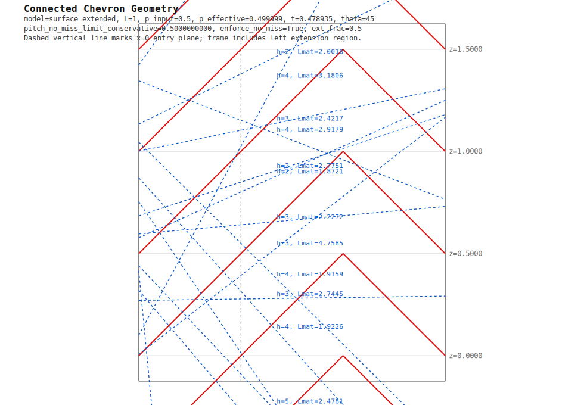

# Chevron Shielding Monte Carlo

This folder contains scripts to evaluate a repeating chevron shielding geometry and compare it to a flat reference wall.

## Files

- `monte_carlo_chevron.py`: Monte Carlo transmission model + solvers.
- `chevron_geometry_svg.py`: SVG geometry/ray visualizer with dimension labels.
- `PROMPT.md`: original problem framing.

## Final Agreed Framing

The final configuration used for the reported figure of merit is:

- Slat angle fixed at `theta = 45 deg`
- Depth fixed at `L = 1`
- Pitch fixed at `p = 0.5` (closure geometry for 45-degree chevrons)
- Model: `surface` (no true geometric slat thickness; attenuation uses crossing angle)
- Flat reference wall thickness: `d = 1`
- Flat reference optical depth: `tau_flat = 5`
- Calibration: `tau_reference = slab` so `lambda = tau_flat / d = 5`

Then solve for chevron attenuation thickness `t` such that:

- `T_chevron ~= T_flat`
- with no misses (`P_no_hit = 0`)

## Reproduce Final Solve

Run:

```bash
~/venvs/gb/bin/python monte_carlo_chevron.py \
  --model surface \
  --L 1 \
  --pitch 0.5 \
  --theta-deg 45 \
  --tau-reference slab \
  --solve-thickness-for-flat \
  --enforce-no-miss \
  --require-no-hit \
  --samples 800000 \
  --t-min 1e-5 \
  --t-max 2.0
```

Representative result:

- solved `t = 0.764942764022`
- `P_no_hit = 0`
- `T_flat = 0.001755601786`
- `T_chevron = 0.001755601718`
- hit-count diagnostics (also printed each run): `P_hit_0 ... P_hit_5`, `P_hit_6plus`, `mean_hits`

## Figure of Merit

Using the requested analytical geometric factor:

- `M = 2*sqrt(2) = 2.828427124746`
- `M' = t*M`

With solved `t`:

- `M' = 2.163584862637`

This is the current ultimate FOM for the agreed setup.

## One-Sided Extension Geometry

A new geometry mode is available:

- `model=surface_extended`
- `--center-extension-frac f` adds a left-tip continuation of the `/` branch by `f*L` (hockey-stick style)
- `f=0.5` corresponds to `+50%` line-length material vs baseline chevron geometry

Comparison at fixed `L=1`, `p=0.5`, `theta=45 deg`, no-miss enforcement, matching `T_flat` by solving `t`
(`samples=500000` for both rows):

| Geometry | Solve `t` | `P_no_hit` | `P_hit_1` | `mean_hits` | `M_geom` | `M'_geom*t` |
|---|---:|---:|---:|---:|---:|---:|
| Basic chevron (`surface`) | `0.765144` | `0.000000` | `0.177982` | `2.819090` | `2.828433` | `2.164158` |
| Extended hockey-stick (`surface_extended`, `f=0.5`) | `0.478935` | `0.000000` | `0.022272` | `4.226746` | `4.242649` | `2.031955` |

Reproduction commands:

```bash
~/venvs/gb/bin/python monte_carlo_chevron.py \
  --model surface --L 1 --pitch 0.5 --theta-deg 45 --tau-reference slab \
  --solve-thickness-for-flat --enforce-no-miss --require-no-hit \
  --samples 500000 --t-min 1e-5 --t-max 2.0

~/venvs/gb/bin/python monte_carlo_chevron.py \
  --model surface_extended --center-extension-frac 0.5 \
  --L 1 --pitch 0.5 --theta-deg 45 --tau-reference slab \
  --solve-thickness-for-flat --enforce-no-miss --require-no-hit \
  --samples 500000 --t-min 1e-5 --t-max 2.0
```

### Hit-Count Output

For `surface` and `surface_extended` models, `monte_carlo_chevron.py` now prints:

- `P_hit_0`, `P_hit_1`, ..., `P_hit_5`
- `P_hit_6plus`
- `mean_hits`

This makes it easy to verify whether one-hit paths dominate transmission for a given geometry.

## Geometry SVG

To generate a dimensioned SVG with sample rays and per-ray evaluated material path (`Lmat`):

```bash
~/venvs/gb/bin/python chevron_geometry_svg.py \
  --model surface \
  --L 1 \
  --pitch 0.5 \
  --thickness 0.764942764022 \
  --theta-deg 45 \
  --enforce-no-miss \
  --num-rays 16 \
  --out chevron_geometry.svg
```

Embedded preview:


## Extended Geometry SVG

To generate the one-sided extended hit diagram (`surface_extended`):

```bash
~/venvs/gb/bin/python chevron_geometry_svg.py \
  --model surface_extended \
  --center-extension-frac 0.5 \
  --L 1 \
  --pitch 0.5 \
  --thickness 0.478935 \
  --theta-deg 45 \
  --enforce-no-miss \
  --num-rays 16 \
  --out chevron_geometry_extended.svg
```

Embedded preview:


