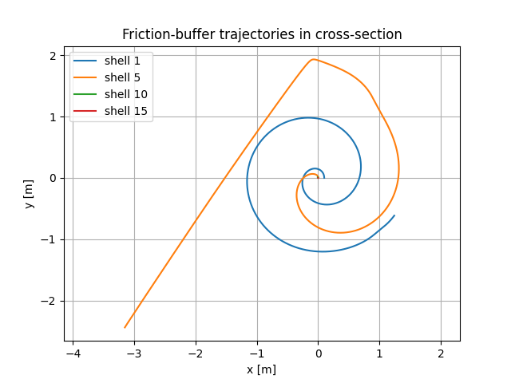
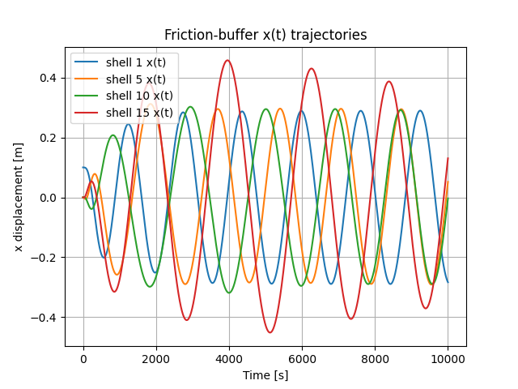

# Changeblog

## First coupled simulation

Here I tried to jump right to simulating with all 16 friction-buffers with the 250m radius reference design.

```
python multi_shell_time_sim.py
```



This is very unstable, the scenarios I did:
 - vanilla run, first stage went unstable
 - with a higher C_DAMP, the 5th stage or something went unstable

The image is of the 2nd one.

But none of this really matters, as specifically the `F_r` equation was made with the wrong assumptions.

Current high priority agenda items are:
 - correcting that `F_r` computation
 - Including the friction-buffer rotational speed in the simulation

The latter point will change us from 2 variables in each stage to 3.
This is necessary because it's almost certain that the final stages of the spiral are shooting
out the stage when there's actually no (or probably negative) relative velocity.
This is a highly stabilizing dynamical effect that can't be seen in the core equations,
although it remains very unclear whether this will change the overall outcome.

## Corrected for long-journal

To give a name to the previously mentioned `F_r` error, that used the **short-journal** assumption,
and we need the long-journal assumption to represent the axial symmetry.

Correct computation of `F_r` is quite complicated looking, but it seems to have worked in the end.
Here I got force values from the two components.
There is a major difference here than from the short-journal assumption,
which is that the two cross-over at a fairly low value.
In the short-journal assumption, the restoring `F_r` didn't become dominant until
maybe 2/3rd the channel width.


Excitingly, the simulation in this current state can produce real output,
over a significant period of time.
This simulation was able to run for 1000 seconds of simulated time.


Here we return again to the observation that `F_r` grows slower than `F_theta`
for small values of displacement. This is the primary driver of the wobble
you see throughout the simulation.

However, this still doesn't track change in angular velocity, which
has a mixed effect but is likely still restorative.

I'm fairly well convinced that this entire family of simulations
is going to produce an initial wobble about. These might
be sustainable and stable, but maybe not.
The next step is to definetely add the accounting for angular momentum.

As for broader implications, this still does not include turbulent flow.
I am very curious as to what implications that might have,
and this might forever be hard to simulate.

The lower cross-over point for the force ratios also has another tantalizing
implication - that a reasonable amount of intentional offset might work
completely to stabilize the construction.

## Including Angular Speeds

This turned out to not have much of an effect given the prior simulation.
But this is likely because of the relatively small displacements seen.

## Longer time runs

Those simulations so far ran 1,000s.
Over that time, relatively small displacements were seen.
This was good, but the small wobbles are concerning for longer-term operation,
as chance interactions over larger scales might still drive it unstable.

This time, I ran for 10,000s keeping everything else the same.
Here is the x position over time, the wobble & y position are
telling pretty much the same story.



Key conclusions here:
 - the movement does reach a limit
 - shell that moves the most is 15, so the furthest out

This last point is intuitive and particularly interesting.
Because the transient started with a variation in position
of the inner-most shell.

You can also see no dampening, which is somewhat intended.
This model very much has no dampening in it on purpose.
If dampening was added, you might see them restore to
their original positions, but still unclear.

## Using a controlled displacement

The idea here is that we might "induce" the wedge effect intentionally.
This would be maintained by a constant force on the bearings of the tube,
pressed against a force maintained out the outermost stationary sheet.
